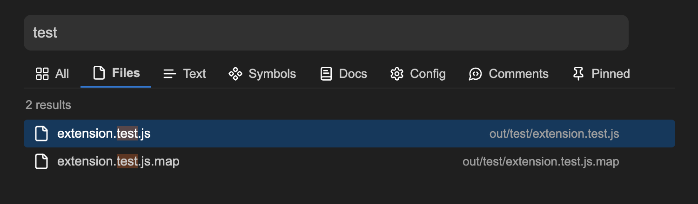
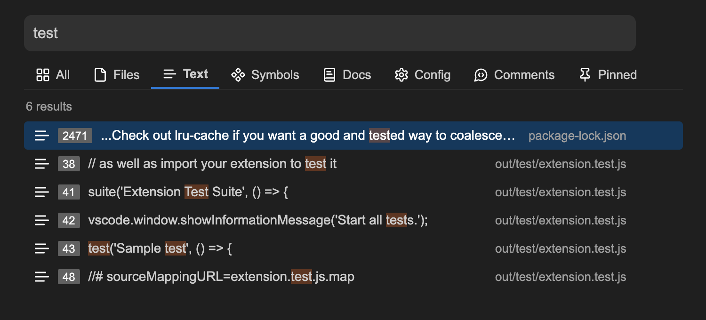
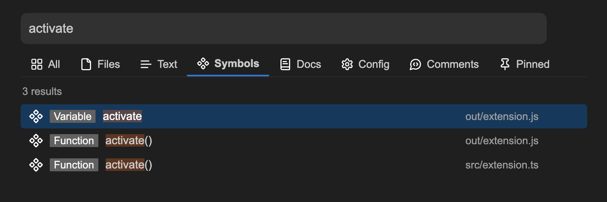
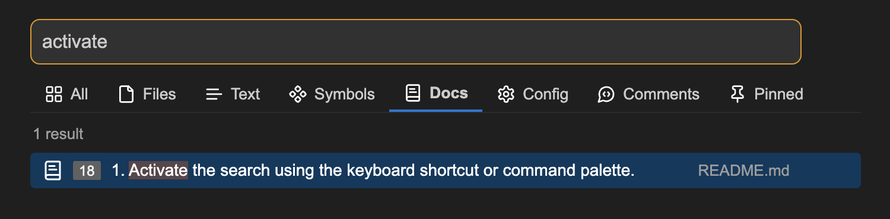
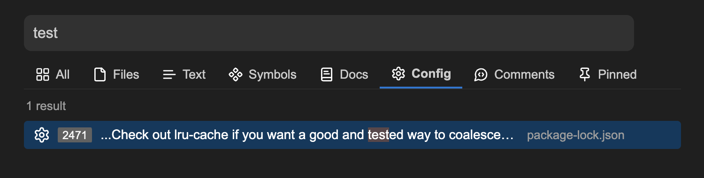
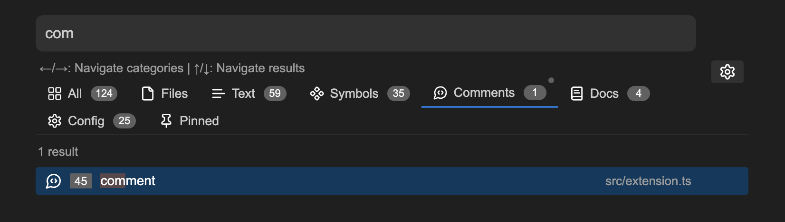
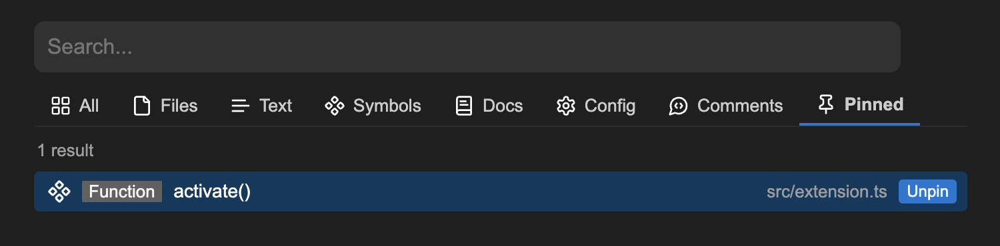
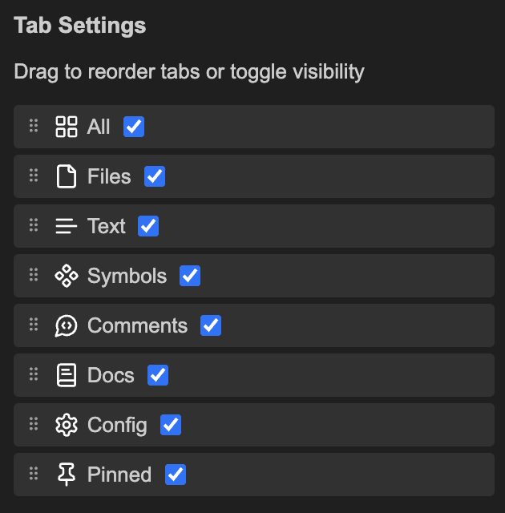
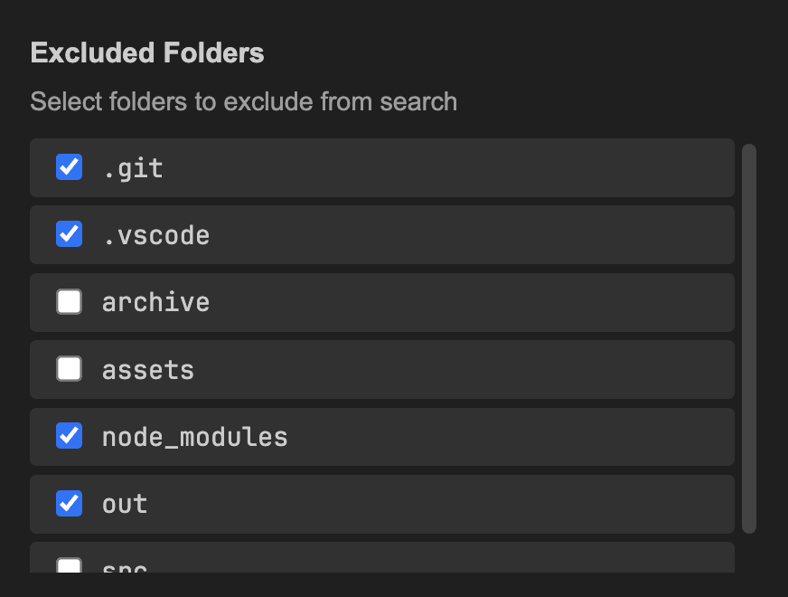

# Smart Search

An extension for advanced search functionality. The extension supports the following search categories:

- [**All**](#examples): Search for everything
- [**Files**](#files): Search for filenames
- [**Text**](#text): Search for full-text content
- [**Symbols**](#symbols): Search for functions and variables
- [**Documentation**](#docs): Search for documentation content
- [**Configuration**](#settings): Search for configuration content
- [**Comments**](#comments): Search for comments
- [**Pinned**](#pinned): Pin search results

## Installation

[VS Code Marketplace](https://marketplace.visualstudio.com/items?itemName=jurajstefanic.smart-search)

## Usage

1. Activate the search using the keyboard shortcut or command palette.
   - **Windows/Linux**: `Ctrl+Alt+F` or `Ctrl+K`
   - **macOS**: `Cmd+Option+F` or `Cmd+K`
   - `> Smart Search: Open Search Popup`
2. Type your search query in the input field
3. Select the appropriate search category
4. Browse through search results
5. Click on a result to open the corresponding file

### Keyboard Shortcuts

- Activate the search
  - **Windows/Linux**: `Ctrl+Alt+F` or `Ctrl+K`
  - **macOS**: `Cmd+Option+F` or `Cmd+K`
- Navigate categories
  - Arrow keys (up/down): `↑/↓`
- Navigate results
  - Arrow keys (left/right): `←/→` or `Shift`
- Open the search result
  - `Enter`

## Examples

### Files

### Text

### Symbols

### Docs

### Config

### Comments

### Pinned

### Settings

