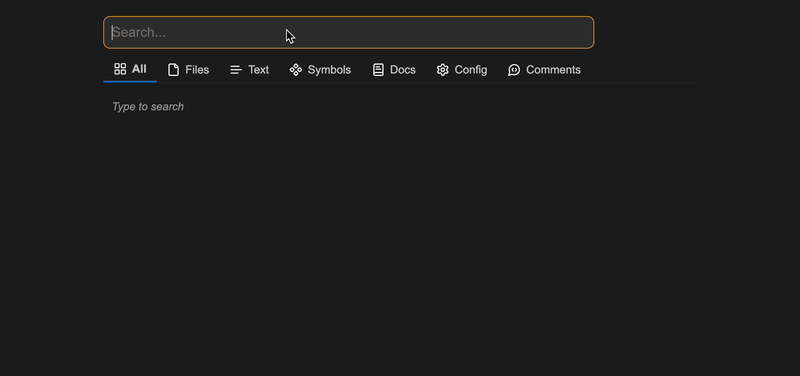
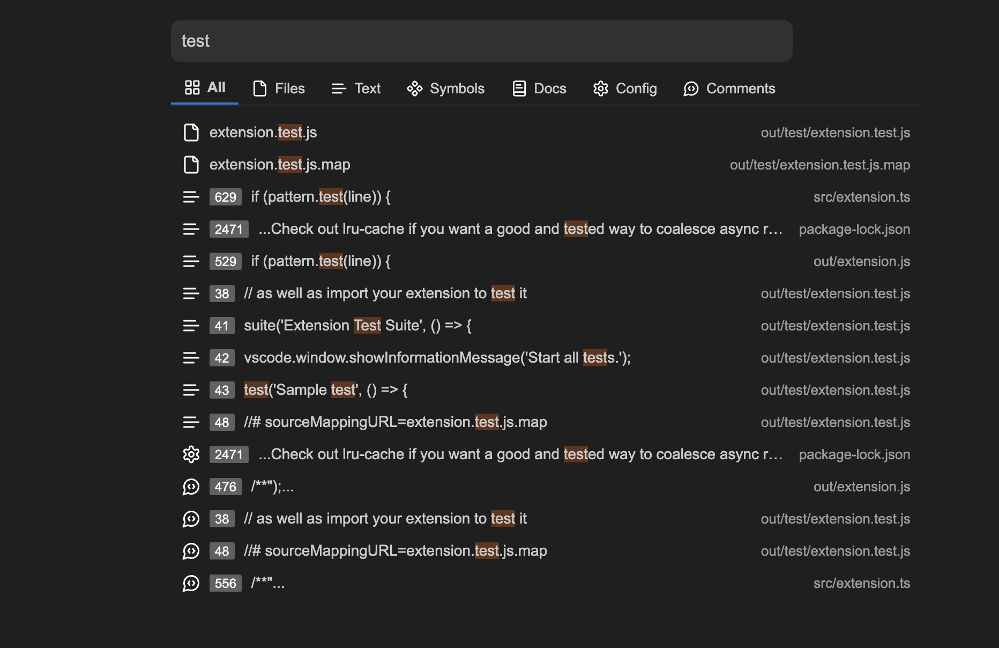

# Smart Search

An extension for advanced search functionality. The extension supports the following search categories:

- **All**: Search for everything below
- **Files**: Search for filenames
- **Text**: Search for full-text content
- **Symbols:** Search for functions and variables
- **Documentation**: Search for documentation content
- **Configuration**: Search for configuration content
- **Comments**: Search for comments

## Usage

1. Activate the search using the keyboard shortcut or command palette.
   1. Windows/Linux: `Ctrl+Alt+F` or `Ctrl+K` / macOS: `Cmd+Option+F` or `Cmd+K`
   2. `> Smart Search: Open Search Popup`
2. Type your search query in the input field
3. Select the appropriate search category
4. Browse through search results
5. Click on a result to open the corresponding file

## Installation

- [VS Code Marketplace](https://marketplace.visualstudio.com/items?itemName=jurajstefanic.smart-search)

## Examples

